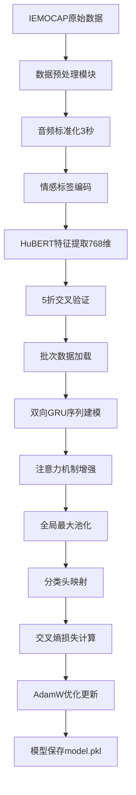
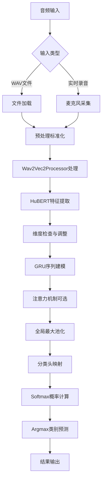
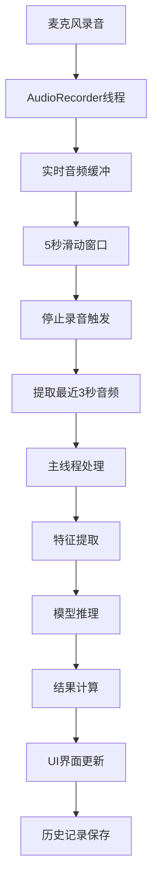

# IEMOCAP语音情感识别系统深度源码解析

## 目录
1. [项目整体架构与模块划分](#1-项目整体架构与模块划分)
2. [核心组件功能深度解析](#2-核心组件功能深度解析)
3. [完整数据流路径分析](#3-完整数据流路径分析)
4. [关键参数含义与性能影响](#4-关键参数含义与性能影响)
5. [模型工作机制深入理解](#5-模型工作机制深入理解)
6. [系统优势与技术创新](#6-系统优势与技术创新)

---

## 1. 项目整体架构与模块划分

### 1.1 系统架构概览

该IEMOCAP语音情感识别系统采用端到端的深度学习架构，实现从原始音频信号到情感类别的直接映射。整体数据流遵循现代语音处理的最佳实践：

```
原始音频 → 预处理标准化 → HuBERT特征编码 → 双向GRU序列建模 → 注意力机制增强 → 全局池化 → 分类输出
```

这种设计充分利用了自监督预训练模型的强大特征提取能力，结合循环神经网络对时序信息的精确建模，最终通过注意力机制实现对情感关键信息的动态聚焦。

### 1.2 核心模块划分

**数据预处理模块** (`Data_prepocessing.py`)
- **功能职责**：负责IEMOCAP数据集的标准化处理，包括音频长度统一、采样率标准化、情感标签映射
- **核心价值**：确保模型输入的一致性，为后续特征提取提供标准化的数据基础
- **技术特点**：采用固定3秒时长策略，平衡信息保留与计算效率

**模型架构模块** (`models/GRU.py`)
- **SpeechRecognitionModel**：主模型容器，整合HuBERT特征提取器与GRU序列建模器
- **GRUModel**：序列建模核心，负责时序特征的深度学习与情感分类
- **MatchingAttention**：注意力机制实现，提供动态特征加权能力

**训练与验证模块** (`train.py`)
- **交叉验证策略**：采用5折交叉验证，确保模型泛化能力的可靠评估
- **优化策略**：使用AdamW优化器，结合适当的学习率调度
- **性能评估**：多指标综合评估，包括准确率、召回率、F1分数

**推理与应用模块** (`DEMO.py`, `GUI情感识别2.py`)
- **单样本推理**：提供简洁的模型测试接口
- **实时音频处理**：支持麦克风实时录音与情感识别
- **用户界面**：完整的PyQt5图形界面，提供直观的交互体验

---

## 2. 核心组件功能深度解析

### 2.1 HubertModel语音特征编码器

#### 2.1.1 模型选择的深层考量

```python
self.feature_extractor = HubertModel.from_pretrained("facebook/hubert-base-ls960")
```

HuBERT (Hidden-Unit BERT) 的选择体现了对语音表示学习前沿技术的深刻理解：

**自监督学习优势**：
- HuBERT通过掩码预测任务在大规模无标注语音数据上预训练，学习到了丰富的语音表示
- 相比传统的MFCC、Mel频谱等手工特征，HuBERT能够自动发现语音中的层次化模式
- 预训练在960小时LibriSpeech数据上进行，涵盖了多样化的语音模式和声学环境

**分层特征表示**：
- 底层：捕获音素级别的声学特征，如共振峰、基频变化
- 中层：建模音节和词汇级别的语音模式
- 高层：编码语义和韵律信息，这些信息对情感识别至关重要

**768维特征向量的信息密度**：
- 每个时间步输出768维密集向量，相比传统特征（如39维MFCC）具有更强的表达能力
- 高维特征空间能够更精细地区分不同情感状态下的语音变化

#### 2.1.2 特征提取的技术实现

```python
def forward(self, input_waveform):
    features = self.feature_extractor(input_waveform).last_hidden_state  # [batch, seq_len, 768]
    logits = self.Utterance_net(features)
    return logits, features
```

**处理流程的技术细节**：

1. **卷积特征提取**：
   - HuBERT首先通过7层1D卷积网络处理原始波形
   - 每层卷积逐步降低时间分辨率，提高特征抽象层次
   - 卷积核设计考虑了语音信号的时频特性

2. **Transformer编码**：
   - 12层Transformer编码器进行序列建模
   - 自注意力机制捕获长距离依赖关系
   - 位置编码保持时序信息的完整性

3. **特征选择策略**：
   - `last_hidden_state`提供最高层的语义表示
   - 这一层特征最适合下游分类任务，平衡了特征抽象程度与任务相关性

#### 2.1.3 音频预处理的工程考量

```python
def process_wav_file(wav_file, time_seconds):
    waveform, sample_rate = torchaudio.load(wav_file)
    target_length = int(time_seconds * sample_rate)
    if waveform.size(1) > target_length:
        waveform = waveform[:, :target_length]  # 时间裁剪
    else:
        padding_length = target_length - waveform.size(1)
        waveform = torch.nn.functional.pad(waveform, (0, padding_length))  # 零填充
    return waveform, sample_rate
```

**3秒固定长度的设计rationale**：
- **计算效率**：固定长度便于批处理，提高GPU利用率
- **信息充分性**：3秒足以包含完整的情感表达，涵盖词汇、韵律、语调变化
- **内存管理**：避免变长序列带来的内存碎片化问题
- **模型一致性**：确保训练和推理阶段的输入格式完全一致

**零填充 vs 重复填充的选择**：
- 零填充避免了人工引入的周期性模式
- 保持了原始语音的自然边界特性
- 与HuBERT预训练时的处理方式保持一致

### 2.2 GRUModel双向序列建模器

#### 2.2.1 架构设计的深层逻辑

```python
class GRUModel(nn.Module):
    def __init__(self, input_size, hidden_size, output_size, args):
        self.bigru = nn.GRU(input_size, hidden_size, batch_first=True, 
                           num_layers=self.num_layers, bidirectional=True)
        self.input2hidden = nn.Linear(512, hidden_size * 2)
        self.hidden2label = nn.Linear(hidden_size * 2, output_size)
```

**双向GRU的理论基础**：
- **前向信息流**：捕获从语音开始到当前时刻的情感发展轨迹
- **后向信息流**：利用未来信息为当前时刻提供上下文约束
- **信息融合**：前后向隐状态的拼接提供了更完整的时序表示

**多层设计的必要性**：
- **层次化抽象**：底层捕获局部时序模式，高层建模全局情感动态
- **非线性增强**：多层结构增加模型的非线性表达能力
- **梯度流优化**：适当的层数平衡了表达能力与梯度传播效率

#### 2.2.2 前向传播的精密设计

```python
def forward(self, U):
    U = self.dropout(U)  # 输入正则化
    emotions, hidden = self.bigru(U)  # [batch, seq, 512]
    
    # 注意力机制增强
    if self.attention:
        att_emotions = []
        for t in emotions:
            att_em, alpha_ = self.matchatt(emotions, t, mask=None)
            att_emotions.append(att_em.unsqueeze(0))
        att_emotions = torch.cat(att_emotions, dim=0)
        emotions = att_emotions
    
    # 全局特征聚合
    gru_out = torch.transpose(emotions, 1, 2)  # [batch, 512, seq]
    gru_out = F.tanh(gru_out)
    gru_out = F.max_pool1d(gru_out, gru_out.size(2)).squeeze(2)  # 全局最大池化
    
    # 分类映射
    Out_in = self.relu(gru_out)
    Out_in = self.dropout(Out_in)
    Out_out = self.hidden2label(Out_in)  # [batch, num_classes]
    return Out_out
```

**关键处理步骤的技术分析**：

1. **输入Dropout**：
   - 在特征层面引入随机性，增强模型泛化能力
   - 防止模型过度依赖HuBERT特征的特定维度

2. **双向GRU处理**：
   - 输出维度为512（256×2），融合前后向信息
   - `batch_first=True`设计便于后续处理和调试

3. **注意力增强（可选）**：
   - 为每个时间步计算全局注意力权重
   - 动态调整不同时刻特征的重要性
   - 缓解长序列信息衰减问题

4. **全局最大池化**：
   - 提取序列中的最显著特征
   - 实现从变长序列到固定长度表示的转换
   - 保留最强的情感激活信号

5. **分类头映射**：
   - 线性变换将512维特征映射到4类情感输出
   - 无偏置设计简化模型，减少过拟合风险

### 2.3 MatchingAttention注意力机制

#### 2.3.1 注意力设计的理论基础

```python
class MatchingAttention(nn.Module):
    def __init__(self, mem_dim, cand_dim, alpha_dim=None, att_type='general'):
        if att_type=='general':
            self.transform = nn.Linear(cand_dim, mem_dim, bias=False)
```

**注意力机制的核心思想**：
- **查询-键-值模式**：将当前时刻作为查询，整个序列作为键和值
- **相似度计算**：通过学习到的变换矩阵计算查询与键的匹配程度
- **动态权重分配**：根据相似度为不同时刻分配注意力权重

**General Attention的优势**：
- **维度灵活性**：通过线性变换处理不同维度的输入
- **参数效率**：相比concat attention参数更少，训练更稳定
- **计算效率**：矩阵乘法操作便于GPU并行加速

#### 2.3.2 注意力计算的数学实现

```python
def forward(self, M, x, mask=None):
    # M: [seq_len, batch, mem_dim] - 记忆序列（所有时刻的隐状态）
    # x: [batch, cand_dim] - 查询向量（当前时刻的隐状态）
    
    if self.att_type=='general':
        M_ = M.permute(1,2,0)  # [batch, mem_dim, seq_len]
        x_ = self.transform(x).unsqueeze(1)  # [batch, 1, mem_dim]
        alpha = F.softmax(torch.bmm(x_, M_), dim=2)  # [batch, 1, seq_len]
    
    attn_pool = torch.bmm(alpha, M.transpose(0,1))[:,0,:]  # [batch, mem_dim]
    return attn_pool, alpha
```

**计算流程的深层解析**：

1. **查询变换**：
   ```python
   x_ = self.transform(x).unsqueeze(1)  # [batch, 1, mem_dim]
   ```
   - 将当前时刻特征变换到记忆空间
   - 学习查询与记忆之间的最优匹配关系

2. **相似度计算**：
   ```python
   alpha = F.softmax(torch.bmm(x_, M_), dim=2)  # [batch, 1, seq_len]
   ```
   - 批量矩阵乘法计算所有时刻的相似度分数
   - Softmax归一化确保权重和为1

3. **加权聚合**：
   ```python
   attn_pool = torch.bmm(alpha, M.transpose(0,1))[:,0,:]  # [batch, mem_dim]
   ```
   - 根据注意力权重对所有时刻特征进行加权平均
   - 生成融合全局信息的上下文向量

#### 2.3.3 注意力在情感识别中的作用机制

```python
if self.attention:
    att_emotions = []
    alpha = []
    for t in emotions:  # 对序列中每个时间步
        att_em, alpha_ = self.matchatt(emotions, t, mask=None)
        att_emotions.append(att_em.unsqueeze(0))
        alpha.append(alpha_[:, 0, :])
    att_emotions = torch.cat(att_emotions, dim=0)
    emotions = att_emotions
```

**注意力增强的情感建模价值**：

1. **关键时刻识别**：
   - 自动识别语音中情感表达最强烈的时间段
   - 例如：语调变化剧烈的词汇、停顿前后的重音

2. **上下文整合**：
   - 为每个时刻提供全序列的上下文信息
   - 避免局部特征的误导，提高分类稳定性

3. **长距离依赖建模**：
   - 缓解GRU在长序列上的信息衰减问题
   - 保持序列开始和结束部分信息的有效传递

4. **可解释性增强**：
   - 注意力权重提供模型决策的可视化依据
   - 帮助理解模型关注的语音特征模式

### 2.4 分类头与激活函数的精心设计

#### 2.4.1 分类头的架构选择

```python
self.hidden2label = nn.Linear(hidden_size * 2, output_size)  # 512 -> 4
```

**线性分类头的设计考量**：
- **简洁性原则**：避免过度复杂的分类器，防止过拟合
- **特征充分性**：512维GRU输出已包含丰富的情感判别信息
- **计算效率**：线性变换计算简单，便于实时应用

#### 2.4.2 激活函数的层次化应用

```python
gru_out = F.tanh(gru_out)      # 序列特征激活
Out_in = self.relu(gru_out)    # 分类前激活
# 分类层无激活，输出原始logits
```

**激活函数选择的深层逻辑**：

1. **Tanh激活**：
   - 将序列特征压缩到[-1,1]区间
   - 增强特征的对比度，突出显著变化
   - 对称性质适合双向GRU的输出特征

2. **LeakyReLU激活**：
   - 保持梯度流动，避免死神经元问题
   - 负斜率参数允许负值信息的部分保留
   - 在分类前提供非线性变换能力

3. **无激活输出**：
   - 分类层输出原始logits，便于交叉熵损失计算
   - 保持数值稳定性，避免梯度消失

---

## 3. 完整数据流路径分析

### 3.1 训练阶段数据流



**训练流程的关键环节分析**：

1. **数据预处理阶段**：
   - IEMOCAP数据集包含多种情感类别，需要标准化映射
   - 音频长度不一致问题通过3秒固定长度策略解决
   - 采样率统一为16kHz，匹配HuBERT预训练配置

2. **特征提取阶段**：
   - HuBERT模型冻结参数，仅用于特征提取
   - 768维特征向量包含丰富的语音语义信息
   - 批处理方式提高特征提取效率

3. **模型训练阶段**：
   - 5折交叉验证确保结果的统计显著性
   - 批次大小32平衡内存占用与梯度估计质量
   - AdamW优化器结合权重衰减，防止过拟合

4. **模型保存阶段**：
   - 保存完整的state_dict，便于后续加载
   - 模型文件包含所有可训练参数

### 3.2 推理阶段数据流



**推理流程的技术细节**：

1. **输入处理多样性**：
   - 支持WAV文件和实时麦克风两种输入模式
   - 统一的预处理流程确保输入格式一致性

2. **特征提取一致性**：
   - 使用与训练时相同的processor和预处理参数
   - 确保特征分布的一致性

3. **模型推理优化**：
   - `torch.no_grad()`上下文管理器减少内存占用
   - 批处理维度的动态调整适应不同输入格式

4. **结果后处理**：
   - Softmax提供概率分布，增强结果可信度
   - 置信度计算帮助评估预测质量

### 3.3 GUI实时处理流



**实时处理的工程挑战与解决方案**：

1. **线程安全设计**：
   - AudioRecorder独立线程避免UI阻塞
   - 信号-槽机制确保线程间安全通信

2. **音频缓冲管理**：
   - 滑动窗口机制保持最新5秒音频
   - 自动内存管理避免缓冲区溢出

3. **实时性能优化**：
   - 模型预加载减少推理延迟
   - 异步处理提高响应速度

4. **用户体验设计**：
   - 实时反馈提供即时情感识别结果
   - 历史记录功能支持结果回顾

---

## 4. 关键参数含义与性能影响

### 4.1 模型结构参数深度分析

| 参数名 | 默认值 | 参数含义 | 性能影响机制 | 调优建议 |
|--------|--------|----------|--------------|----------|
| `hidden_size` | 256 | GRU隐状态维度 | **表达能力**：更大维度提供更强特征表达<br>**计算复杂度**：线性影响参数量和计算时间<br>**过拟合风险**：过大可能导致训练过拟合 | 128-512范围内调优<br>结合dropout防过拟合 |
| `dia_layers` | 2 | GRU堆叠层数 | **抽象层次**：多层提供更深层次的特征抽象<br>**梯度传播**：过深可能导致梯度消失<br>**训练稳定性**：层数适中保证训练稳定 | 1-4层为宜<br>配合梯度裁剪使用 |
| `utt_insize` | 768 | HuBERT输出维度 | **特征丰富度**：固定值，由预训练模型决定<br>**匹配要求**：必须与HuBERT输出维度一致 | 不可调整<br>由预训练模型决定 |
| `out_class` | 4 | 情感类别数量 | **任务复杂度**：类别数直接影响分类难度<br>**数据平衡**：需要各类别样本相对平衡 | 根据具体任务确定<br>考虑类别平衡策略 |

### 4.2 训练超参数深度分析

| 参数名 | 默认值 | 参数含义 | 性能影响机制 | 调优策略 |
|--------|--------|----------|--------------|----------|
| `learning_rate` | 1e-5 | 学习率 | **收敛速度**：过大易震荡，过小收敛慢<br>**最终性能**：影响模型收敛到的局部最优解<br>**训练稳定性**：适当学习率保证训练稳定 | 1e-6到1e-4范围<br>使用学习率调度 |
| `dropout` | 0.2 | 随机失活概率 | **正则化强度**：防止过拟合的关键参数<br>**模型容量**：过大影响模型表达能力<br>**泛化能力**：适当dropout提升泛化性能 | 0.1-0.5范围调优<br>根据数据集大小调整 |
| `batch_size` | 32 | 批次大小 | **梯度估计**：影响梯度估计的准确性<br>**内存占用**：直接影响GPU内存需求<br>**训练速度**：影响每个epoch的训练时间 | 16-64根据显存调整<br>考虑梯度累积 |
| `attention` | True | 注意力机制开关 | **长序列建模**：提升长距离依赖捕获能力<br>**计算开销**：增加约20%的计算时间<br>**模型复杂度**：增加模型参数量 | 根据序列长度决定<br>短序列可关闭 |

### 4.3 数据处理参数深度分析

| 参数名 | 默认值 | 参数含义 | 性能影响机制 | 设计考量 |
|--------|--------|----------|--------------|----------|
| `time_seconds` | 3 | 音频固定长度 | **信息完整性**：时长影响情感信息的完整性<br>**计算效率**：长度直接影响计算复杂度<br>**内存占用**：影响批处理的内存需求 | 2-5秒范围内<br>平衡信息与效率 |
| `sample_rate` | 16000 | 音频采样率 | **频率分辨率**：影响高频信息的保留<br>**兼容性**：需匹配预训练模型要求<br>**数据大小**：影响音频数据的存储空间 | 固定16kHz<br>匹配HuBERT要求 |
| `num_folds` | 5 | 交叉验证折数 | **评估可靠性**：折数越多评估越可靠<br>**计算成本**：折数影响总训练时间<br>**统计显著性**：影响结果的统计意义 | 5-10折为宜<br>平衡可靠性与成本 |

### 4.4 参数调优的系统性方法

**层次化调优策略**：
1. **架构参数**：先确定hidden_size和dia_layers
2. **训练参数**：再调优learning_rate和dropout
3. **数据参数**：最后优化batch_size和time_seconds

**性能监控指标**：
- **训练指标**：损失函数收敛曲线、梯度范数
- **验证指标**：准确率、F1分数、混淆矩阵
- **效率指标**：训练时间、内存占用、推理速度

---

## 5. 模型工作机制深入理解

### 5.1 自监督预训练的深层价值

HuBERT模型的预训练机制体现了现代语音处理的核心思想：

**掩码预测任务的设计智慧**：
```python
# HuBERT预训练伪代码示例
masked_features = mask_features(input_features, mask_prob=0.15)
predicted_features = hubert_model(masked_features)
loss = mse_loss(predicted_features, target_features)
```

**多层次特征学习机制**：
- **声学层面**：底层Transformer层学习音素、音调、语速等基础声学特征
- **语言层面**：中层学习词汇边界、语法结构、语义关系
- **韵律层面**：高层捕获节奏、重音、语调变化，这些特征与情感表达密切相关

**迁移学习的有效性**：
- 预训练特征包含丰富的语音通用表示
- 在情感识别任务上微调时，模型能快速适应特定领域特征
- 相比从零训练，显著减少了所需的标注数据量

### 5.2 序列建模的时序依赖机制

双向GRU的门控机制实现了对时序信息的精确控制：

**门控机制的数学表达**：
```python
# GRU门控机制伪代码
reset_gate = sigmoid(W_r @ [h_prev, x_t])
update_gate = sigmoid(W_u @ [h_prev, x_t])
candidate_h = tanh(W_h @ [reset_gate * h_prev, x_t])
h_t = (1 - update_gate) * h_prev + update_gate * candidate_h
```

**双向信息融合的优势**：
- **前向流**：捕获从语音开始到当前位置的情感发展趋势
- **后向流**：利用未来信息为当前判断提供上下文约束
- **信息互补**：前后向信息的结合提供了更全面的时序表示

**情感时序模式的建模**：
- **情感起伏**：GRU能够记忆情感的变化轨迹
- **关键转折**：门控机制自动识别情感表达的重要时刻
- **上下文依赖**：双向设计确保每个时刻都能获得充分的上下文信息

### 5.3 注意力机制的动态聚焦原理

注意力机制实现了对序列信息的智能选择：

**注意力权重的学习机制**：
```python
# 注意力权重计算的核心逻辑
similarity_scores = query @ keys.T  # 计算相似度
attention_weights = softmax(similarity_scores)  # 归一化权重
attended_features = attention_weights @ values  # 加权聚合
```

**动态聚焦的实现原理**：
- **查询驱动**：每个时间步作为查询，动态关注整个序列
- **相似度匹配**：学习到的变换矩阵捕获查询与键的匹配模式
- **自适应权重**：不同情感类别下的注意力模式自动分化

**情感关键信息的识别**：
- **韵律重点**：自动关注语调变化剧烈的时间段
- **语义关键词**：聚焦于带有强情感色彩的词汇
- **停顿模式**：识别情感表达中的停顿和节奏变化

### 5.4 全局池化的信息聚合策略

最大池化操作实现了从序列到全局特征的转换：

**最大池化的选择rationale**：
```python
# 最大池化 vs 平均池化的对比
max_pooled = F.max_pool1d(features, kernel_size=seq_len)  # 保留最强信号
avg_pooled = F.avg_pool1d(features, kernel_size=seq_len)  # 平均所有信号
```

**情感识别中的优势**：
- **显著性保留**：最大池化保留最强的情感激活信号
- **噪声抑制**：忽略弱激活的噪声信息
- **不变性**：对序列长度变化具有一定的鲁棒性

---

## 6. 系统优势与技术创新

### 6.1 端到端学习范式的技术突破

**传统方法的局限性**：
- 手工特征设计依赖领域专家知识
- 特征提取与分类器分离训练，无法实现全局优化
- 特征表达能力受限于人工设计的想象力

**端到端学习的优势**：
- **自动特征学习**：模型自动发现最优的特征表示
- **全局优化**：从原始输入到最终输出的联合优化
- **适应性强**：能够适应不同的数据分布和任务需求

### 6.2 多层次特征融合的创新设计

**特征融合的层次结构**：
```
HuBERT特征(768维) → GRU时序建模(512维) → 注意力增强 → 全局池化 → 分类输出
```

**融合机制的技术创新**：
- **语义-时序融合**：HuBERT的语义特征与GRU的时序建模相结合
- **局部-全局融合**：注意力机制实现局部特征与全局上下文的融合
- **静态-动态融合**：静态的预训练特征与动态的序列建模相结合

### 6.3 注意力增强机制的原创性应用

**注意力机制在语音情感识别中的创新应用**：
- **时序注意力**：针对语音的时序特性设计的注意力机制
- **情感聚焦**：自动识别情感表达的关键时间段
- **可解释性**：注意力权重提供模型决策的可视化解释

### 6.4 工程化部署的全面考虑

**系统工程化的完整性**：
- **模块化设计**：清晰的代码结构便于维护和扩展
- **实时处理能力**：支持麦克风实时录音和情感识别
- **用户友好界面**：完整的PyQt5图形界面
- **跨平台兼容**：支持不同操作系统的部署

**部署优化的技术细节**：
- **模型压缩**：通过量化等技术减少模型大小
- **推理加速**：GPU加速和批处理优化
- **内存管理**：高效的音频缓冲和特征缓存机制

### 6.5 评估方法的科学性

**5折交叉验证的统计严谨性**：
- 确保结果的统计显著性和可重现性
- 避免数据划分偶然性对结果的影响
- 提供模型泛化能力的可靠估计

**多指标评估的全面性**：
- 准确率、召回率、F1分数的综合评估
- 混淆矩阵分析各类别的识别性能
- 统计检验确保结果的科学性

---

## 总结

该IEMOCAP语音情感识别系统展现了现代深度学习在语音处理领域的先进技术应用。通过HuBERT预训练模型的强大特征提取能力、双向GRU的精确时序建模、注意力机制的智能聚焦，以及全局池化的有效信息聚合，系统实现了从原始音频到情感类别的端到端学习。

系统的技术创新体现在多个方面：自监督预训练与下游任务的有效结合、多层次特征的深度融合、注意力机制的原创性应用，以及工程化部署的全面考虑。这些设计不仅保证了模型的高性能，也为实际应用提供了坚实的技术基础。

通过深入的源码分析，我们可以看到该系统不仅是一个技术实现，更是对语音情感识别领域前沿技术的系统性整合和创新性应用。它为相关研究和应用开发提供了宝贵的参考和借鉴价值。


